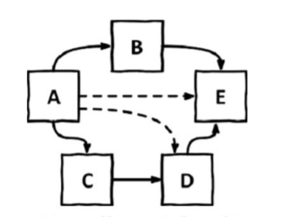
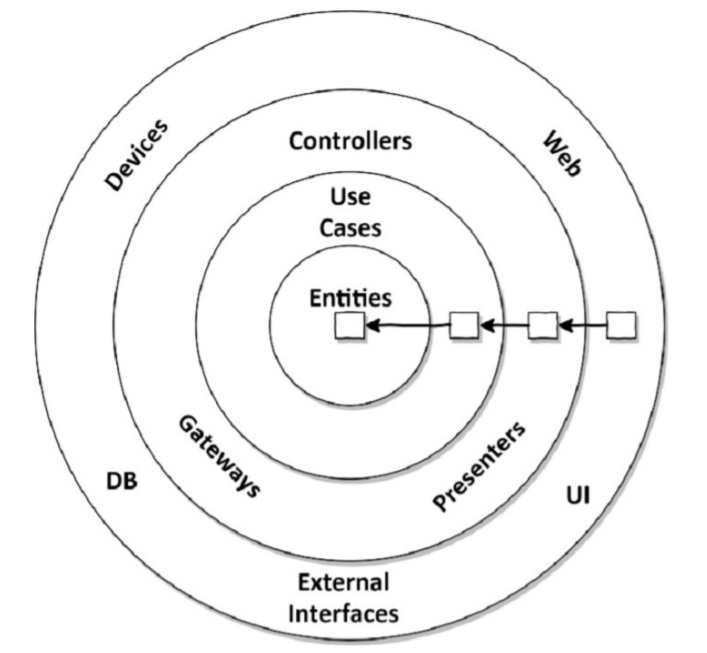
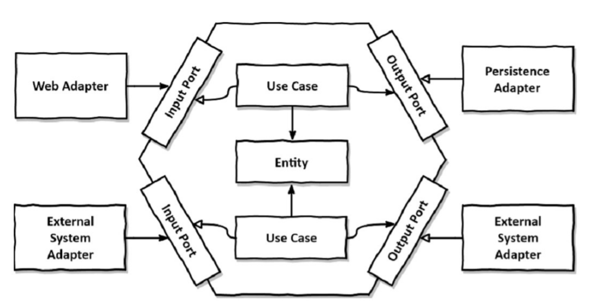

# 02. 의존성 역전하기

## “계층형 아키텍처의 대안“

### 단일 책임 원칙

---기

정의: 컴포넌트를 변경하는 이유는 오직 하나뿐이여야 한다.

다른 컴포넌트의 변경하더라도 해당 컴포넌트에 대해서는 전혀 신경 쓸 필요가 없기 때문에 소프트웨어가 변경되더라도 여전히 우리가 기대한 대로 동작할 수 있기 때문이다.

**하지만, 컴포넌트간 의존성으로 인해 변경에 대한 이유는 쉽게 전파되기 마련이다.**

예시

</img>

- E에 비해 A는 여러 의존성 때문에 변경할 확률이 높다.

  *화살표는 곧 변경할 이유의 개수이다.

- 시간이 갈수록 바꿔야 하는 것들이 많아지며 SRP때문에 복잡성으로 인해 변경이 어려워 비용이 증가한다.
- 변경할 이유가 많아진다면 다른 컴포넌트가 무너지는 원인이 될 수 도 있다.
- 의존의 많이 걸리는 컴포넌트의 변경은 위험하다. 그러므로 의존의 방향은 매우 중요하다.

### 의존성 역전 원칙

---

</img>

계층형의 문제점

- 계층형은 상위에서 하위로 흐르는 단방향 흐름을 가지는 특성을 가지고 있다.
- 해당 특성으로 부터 상위 계층은 하위계층들에 비해 변경할 이유가 더 많아지게 된다.

  : 알고있는 것, 참조하는 것이 많아지기 떄문이다.

  예시) 내부에 있는 영속성 계층 변경 시 상위 계층 또한 변경해야 한다.

- 영속성 계층의 레포지토리가 도메인 계층에 있는 엔티티에 의존하기 때문에 순환 의존성이 발생한다

**이때, DIP를 사용한다.**

</img>

도메인 계층에서는 인터페이스로 대체 함으로써 리포지토리는 의존의 방향이 거꾸로가 되었다.

실제 구현체에서 영속성 계층에서 구현하게 하는 것이 DIP이다.

### 클린 아키텍처

</img>

장점

- 비즈니스 규칙이 독립적(프레임워크, 데이터베이스, UI, 등등)
- 비즈니스 규칙 테스트 용이
- 도메인 코드가 바깥으로 향하는 의존성이 없음
- 도메인 엔티티가 코어에 존재.
    - SRP로 인해 엔티티를 세분화함으로 넓은 범위의 서비스 문제를 해결함,
- 도메인 주변으로 다른 컴포넌트가 존재
- 바깥쪽 계층은 서드파티에 어댑터 제공
- DDD 적용 가능

  단점

- 도메인 엔티티는 독립적으로 구성해야 하므로 ORM 같은 경우에 영속성 계층에서 도메인 엔티티를 따로 가지고 있고 계층간에 변환을 무조건적으로 사용해야 한다.

### 육각형 아키텍처 (핵사고날 아키텍처)

</img>

- 육각형 안에는 도메인 엔티티와 이와 상호작용하는 유스케이스 존재
- 육각형에서 외부로 향하는 의존성이 없다. (모든 이존성은 코어를 향함)
- 육각형 바깥에는 앱과 상호작용하는 다양한 어댑터 존재
- 웹 브라우저와 상호작용하는 웹 어댑터 / 데이터베이스와 상호작용하는 어댑터 / 외부 시스템과 상호작용하는 어댑터 등
- 왼쪽은 코어를 호출하는 어댑터 (앱을 주도하는)
- 오른쪽은 코어가 호출하는 어댑터 (웹에 주도되는)
- 코어와 어댑터간 통신은 포트를 통함
- 포트
    - 주도하는 어댑터(왼쪽==인풋)에게는 코어에 있는 유스케이스에 의해 구현되고 어댑터로부터 호출되는 인터페이스
    - 주도되는 어댑터(오른쪽 == 아웃풋)에게는 어댑터에 의해 구현되고 코어에 의해 호출되는 인터페이스
- 계층적 의미
    - 바깥 - 어댑터, 앱과 다른 시스템간의 번역담당
    - 중간 - 포트와 유스케이스 구현체, 애플리케이션 계층, 인터페이스 정의
    - 안쪽 - 엔티티

### 유지보수 가능한 소프트웨어를 만드는데 어떻게 도움이 될까?

- DIP로 인해 도메인 코드가 다른 어떤 컴포넌트에도 의존하지 않게 함으로써 코드를 변경할  이유의 수를 줄인다.
- 도메인 코드는 비즈니스 문제에만 집중하고 영속성 코드와 UI 코드도 각자의 문제에 집중할 수 있다.