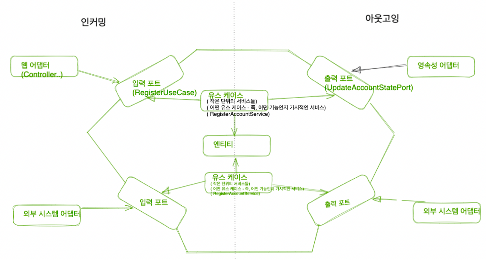

## Intro

아키텍쳐 코드 갭 (architecture-code-gap) (model-code-gap) 이라는 용어는 “ 아**키텍쳐는 코드에 직접적으로 매핑될 수 없는, 추상적인 개념**이다 “ 라는 뜻을 가진다.

과연 그럴까?

아키텍쳐는 코드에 직접적으로 매핑될 수 없는 개념인걸까?

우리는 **패키지 구조를 통해 아키텍쳐를 코드에 매핑 할 수 있다**. 물론 이를 유지하기는 매우 어렵다.

만약 **패키지 구조가 아키텍쳐 를 반영할 수 없다면, 시간이 지남에 따라 코드는 점점- 목표하던 아키텍쳐로부터 멀어질 것**이다.  그리고 이러한 패키지 구조를 사용할 경우, 현재 작업 중인 코드를 어떤 패키지에 넣을 지 계속해서 생각하게 된다. ( 패키지 구조를 보며 우리의 머리는 계속 생각하기 때문이다  )

---

## 아키텍쳐 를 파악할 수 없는 패키지 구조

앞서 보았던 클린아키텍쳐 를 위한 구체적인 방안인 헥사고날 아키텍쳐 의 그림이다.

우리는 **책을 따라서 ‘헥사고날 아키텍쳐’로 기존의 코드를 변경시키기로** 했다.


그런데 ***만약 우리의 패키지 구조가 여전히 “계층구조 아키텍쳐” 를 나타내는 구조라면*** 어떨까?

```jsx
app
├──domain
│. └── Account
│. └── Activity
│. └── AccountRepository (interface)
│. └── AccountService
│
├── persistence
│. └── AccountRepositoryImpl
│
├── web
│. └── AccountController
```

### 단점 1 : 특정 기능을 구분 짓는 패키지 경계가 없다

만약 “사용자를 관리하는 기능” 을 추가한다고 생각해보자.  아래와 같이 추가되는 클래스들이 존재할 것이다.

```jsx
app
├──domain
│. └── Account
│. └── Activity
│. └── (추가) User
│. └── AccountRepository (interface)
│. └── AccountService
│. └── (추가)UserService
│. └── (추가)UserRepository
├── persistence
│. └── AccountRepositoryImpl
│. └── (추가)UserRepositoryImpl
│
├── web
│. └── AccountController
│. └── (추가)UserController
```

- **“사용자 관련 기능” 과 “ 계좌 “ 관련 기능이 같은 레벨의 하나의 패키지에 섞여** 있다.
    - ( import 없이도 , 서로 연관되지 않은 기능임에도 마구 사용하려는 시도도 분명 존재할 것 이다.)

### 단점 2 : 유즈케이스 파악이 힘들다

- **어디에서 “해당 유즈 케이스를 구현” 한 것인지, 패키지 구조만을 보고 찾기에는 힘들**다.
    - 대충 유추해서, “계좌 생성” 이라는 유즈케이스가 `AccountService` 에 있겠구나 하고 들어간다고 해 보자. → 여기서 ***또, “어떤 메소드가 이 책임을 수행하고 있는지” 를 찾아야*** 한다.
    - ( 물론, `AccountService` 가 아닌 `RegisterAccountService` , `SendMoneyService` 이런식으로 “ *유즈케이스를 분리하여 책임을 좁힐 수 “ 있을 것*이다 )

### 단점 3 : 우리가 목표한 아키텍쳐를 파악할 수 없다.

사실 *위 구조만 보면 “계층형 아키텍쳐인가” 라는 생각부터 들 것* 같다.

- 육각 아키텍쳐 스타일을 따르는 경우에는
    - 어떤 기능이 , ex)웹 어댑터  에서 호출되는지
    - ex)영속성 어댑터가 도메인 계층에 어떤 기능을 제공하는지

  를 한눈에 알아볼 수 있는 것이 좋다.

    - 즉, ***incoming port 와 outcoming port 가 드러나는 것이 좋은 듯*** 하다.

## 기능으로만 구성한다면?

(궁금한 부분❓🤔 → 책(25p)에서는 이 구조만으로도, 육각형 아키텍쳐를 따랐다고 추측할 수는 있다고 합니다. 저는 현재 모습 만으로는 육각 아키텍쳐를 따랐다고 추측이 힘들 것 같은데, 어떤 이유에서 추측이 가능하다고 하는 걸까요? 의존성 역전 원칙을 사용하며, 도메인 패키지 방향으로 의존성 방향을 역전 시키려고 한 것 때문 일까요? )

- 특징
    - 연관된 기능만을 기준으로 클래스들을 모아둔 것이다.
    - 외부에서도 이들을 사용하는 것이 필요할 것이다. ***외부의 접근을 막을 필요***가 있는 클래스는 `**package-private**` 수준을 이용 할 수 있다— 패키지 간의 경계 강화
        - 이는 곧, ***“기능 사이의 불필요한 의존성을 방지”*** 하는 것이 된다.

```jsx
app
├──account
│. └── Account
│. └── AccountRepository (interface)
│. └── AccountService
│. └── AccountRepositoryImpl
│. └── AccountController-

```

### 이 어플리케이션의 “기반이 되는 아키텍쳐” 가 보이지 않게 된다.

- 육각 아키텍쳐의
    - 어댑터를 나타내는 패키지도 안 보이고
    - port 를 확인할 수도 없다.
- DIP 를 통해 Service 가 Repository 인터페이스만을 알고 있어도 되게 했었다. 그런데 **현재 “ 그 구현체 까지 동일한 패키지” 에 존재** 하게 되면서 **“실수로, 구현체에까지 - 현재는 영속성 계층에 해당하는 코드에까지 의존” 하게 될 수도** 있다.

> 기반 아키텍쳐에 해단 표현력을 가진 패키지 구조를 만들어 보자
>

## 아키텍쳐적으로 표현력 있는 패키지 구조

- 육각 아키텍쳐가 잘 드러난 부분
    - Port
    - Adapter
    - 유즈케이스
    - 엔티티

```jsx
buckpal
├── account
│   ├── adapter
│   │   ├── in
│   │   │   └── web
│   │   │       └── AccountController.java
│   │   └── out
│   │       └── persistence
│   │           ├── AccountPersistenceAdapter.java
│   │           └── SpringDataAccountRepository.java
│   ├── application
│   │   ├── SendMoneyService
│   │   ├── port
│   │   │   ├── in
│   │   │   │   ├── SendMoneyUseCase.java
│   │   │   └── out
│   │   │       ├── LoadAccountPort.java
│   │   │       └── UpdateAccountStatePort.java
│   └── domain
│       ├── Account.java
│       ├── Activity.java

```

- account 패키지 : Account 엔티티와 관련된 “유즈케이스” 를 구현한 모듈
    - domain **패키지**
    - **application 패키지 :**
        - **도메인 모델을 둘러싸는 “서비스 계층 ” (** 그림을 생각해보자. 유즈케이스는 incoming, outcoming port 를 사용 or 구현하는 모습 이었다. 따라서 port 도 해당 패키지 내부에 들어가게 되는 거라고 이해할 수 있을 듯 하다 ) 과
            - *서비스는 incoming 포트들 뒤에 숨겨져 있을 수 있다 → public x*
        - **각종 port 들**
            - *어댑터에서 접근해야 하는 포트들 → public*
    - adapter 패키지 : 어댑터들이 존재한다. 이들은
        - incoming 포트를 “사용”
        - outcoming 포트를 “구현”

      따라서, ***어댑터들은 “package-private” 접근 수준을 가질 수 있으며*** 이를 통해, 어플리케이션 내의 다른 곳에서 실수로!! 어댑터에 의존하는 일을 방지할 수도 있다

        - 같은 패키지에 어댑터들이 존재 하므로, 다른 구현체로 교체 하는 것도 가능하다. NoSQL 기반 영속성 어댑터 → RDBMS 기반 영속성 어댑터로 변경 가능.



- 이러한 구조는 DDD 개념에 직접 대응시킬 수 있다.
    - account 는 다른 “바운디드 컨텍스트와 통신” 할 Port 를 포함하는 Bounded context 이다.

### 가능한가?

- 이러한 패키지 구조를, **개발 내내 유지하는 것은 어렵다**. 어떨 때는 결국 이 구조가 적합하지 않아, 아키텍쳐를 반영하지 않는 패키지를 만들어야 하는 경우도 존재할 수 있다.
- 즉, ***완벽한 방법은 없다***는 것이다.

## 의존성 주입

> application → adapter 로의 의존성을 가지면 안된다
>
- incoming 의 경우 , 어댑터 → 서비스를 의존하는 제어 방향을 볼 수 있다.
- outgoing 의 경우, 제어흐름의 반대 방향으로 의존성을 돌리기 위해 DIP 를 사용했다.
    - ( 🤔 ❓ outgoing 의 경우, DIP 를 통해 application 에서 의존할 뻔한 어댑터를, 어댑터가 아닌 port 로 의존성을 역전 한 것 같다...   제어 방향이 유즈케이스 → 출력 으로 향하도록 하는데, 출력포트 역시 바깥쪽으로 방향이 향하면 안되기 때문에 이러한 역전원칙을 사용한 것 같다. )


- application 계층의 port 에 interface 를 정의하고, adapter 측에서 이 포트에 대한 구현체를 제공한다고 했다.
- 그렇다면, application 계층에 제공하는 객체를 그 특정한 구현체로 결정하는 것은 누구인가????
    - application 계층 내에서, 직접 명시 해 줘야 하나? → 그럼 구현체( 어댑터 )가 변경될 경우, application 코드에도 변경이 생긴다  ( 의존성이 추가되는 것 )
- ***의존성 주입*** 을 하자.
    - 이를 위해 “***새로운 컴포넌트를 추가***” 한다.
    - 아키텍쳐를 구성하는 **대부분의 클래스를 초기화 하는 역할** ( 스프링에서 @Configuration  클래스에서 빈들간의 관계를 설정하는 모습을 떠올려 볼 수 있다 )

## 결론 - 유지보수에는 어떤 도움이 되는가?

실제 코드 구조를, 우리 어플리케이션의 기반 아키텍쳐에 가깝게 만들어 주기 위한 “패키지 구조” 를 살펴 봤다.

아키텍쳐상 특정한 구성 요소를 찾기 위해, 패키지 구조를 탐색하면 된다.

이로서, 의사소통, 개발, 유지보수가 쉬워질 것을 기대할 수 있다.