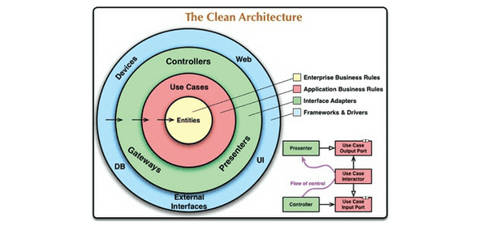
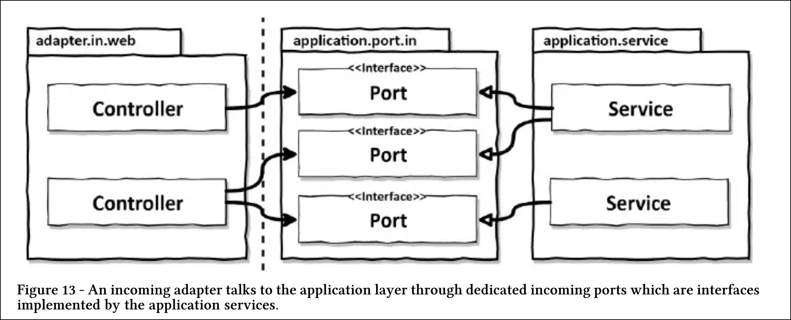
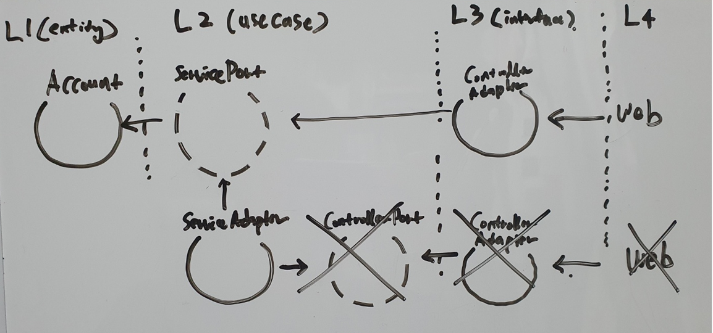
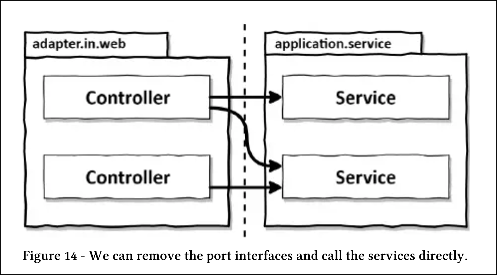
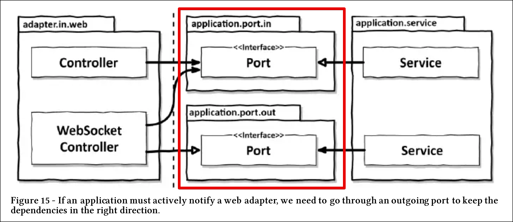

# 웹 어댑터 구현하기
포트 : 인터페이스
어댑터 : 포트의 구현체
인커밍 어댑터 : 외부로부터 요청을 내부로직 수행
아웃고잉 어탭터 : 내부에서 외부로 데이터 전달

## 의존성 역전

_x 는 의존성 방향을 혼동하여 잘못 그린 그림. 위의 그림이 알맞은 그림이다_

> "헥사고날 아키텍처는 포트와 어댑터로도 알려져 있다. 외부 타입마다 어탭터가 존재하고, 외부 영역은 애플리케이션의 API(Application Programming Interface)를 통해 내부 영역과 이어진다."

- 웹 어댑터(인커밍 어댑터) : 외부로부터 요청을 받아 어플리케이션 코어를 호출
- 애플리케이션 계층(L2) 는 웹 어댑터가 통신할 수 있는 특정 포트를 제공한다.
- 서비스는 이 포트를 구현하고, 웹 어탭터는 이 포트를 호출한다.
- 외부타입마다 어탭터가 존재하며 해당 포트(명세)의 기능을 작동시키는 모듈 형태로 쉽게 변경가능하다(독립적이다)
- 이 과정에서 의존성 역전 원칙이 적용된다.

- 웹 어댑터(컨트롤러) 가 유스케이스(서비스)를 직접 호출할 수 있지만 간접 계층을 통해 애플리케이션 코어가 외부 세계와 통신할 수 있는 곳에 대한 명세인 포트의 역할을 수행한다.
- 포트를 통해 외부와 어떤 통신이 일어나는지 정확히 알 수 있다.
 

- 웹 소켓을 통해 데이터를 사용자의 브라우저로 보낼때도 포트가 필요하며 이때 포트는 아웃고잉 어댑터가 된다.
- 웹 어댑터(아웃고인 어댑터) : 데이터를 사용자의 브라우저로 전송
- 한 어댑터가 2가지 역할을 동시에 수행할 수 있다.

## 웹 어댑터의 책임(인커밍 어댑터)
- HTTP 요청을 자바 객체로 매핑
- 권한 검사
- 입력 유효성 검증
- 입력을 유스케이스의 입력 모델로 매핑
- 유스케이스 호출
- 유스케이스의 출력을 HTTP로 매핑
- HTTP 응답을 반환
    - 웹어댑터의 유효성 검증이란 유스케이스 유효성 검증과 똑같이 구현하는 것이 아니다.
    - **웹 어댑터의 입력 모델을 유스케이스의 입력 모델로 변환할 수 있다는 것을 검증해야 한다**
    - HTTP 와 관련된 것이 애플리케이션 계층으로 침투해서는 안된다.

## 컨트롤러 나누기
> 모델을 공유하지 않은 여러 작은 클래스를 만드는 것을 두려워 하지 마라 각 컨트롤러가 가능한 좁고, 다른 컨트롤러와 가능한 한 적게 공유하는 웹 어댑터 조각을 구현해야 한다

- 가독성이 좋아진다
- 테스트 코드가 찾기 쉬어진다
- 전용 모델 클래스들은 private 선언할 수 있기 때문에 실수로 다른 곳에서 재사용될 일이 없다
- 동시작업이 쉬어진다
- 공수가 더 많이 들겠지만 결국에는 유지보수성이 좋아진다

웹어댑터와 애플리케이션 계층간 경계는 도메인과 애플리케이션 계층부터 개발하기 시작하면 자연스럽게 생긴다. 이는 특정 어댑터를 생각할 필요없기 때문에 경계를 흐리게 만드는 상황에 빠지지 않을 수 있다

