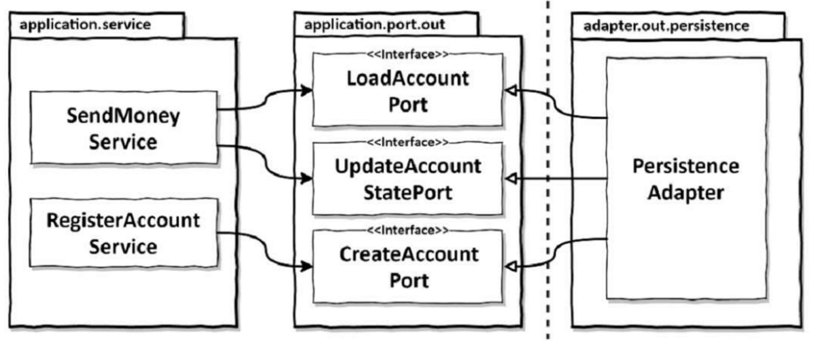

# 영속성 어댑터 구현하기

> 1장에서는 전통적인 계층형 아키텍처에 대해 부정적으로 이야기하면서 이 아키텍처에서는 결국 모든 것이 영속성 계층에 의존하게 되어 “데이터베이스 주도 설계”가 된다고 이야기 하고 있었습니다.
**6장에서는 이러한 의존성을 역전시키기 위해 영속성 계층을 애플리케이션 계층의 플러그인으로 만드는 방법을 살펴보는 장입니다.**
>

## 의존성 역전

영속성 계층 대신 애플리케이션 서비스에 영속성 기능을 제공하는 영속성 어댑터에 대해 이야기를 시작하겠습니다.

아래의 그림은 영속성 어댑터가 애플리케이션 서비스에 영속성 기능을 제공하기 위해 어떻게 의존성 역전 원칙을 적용할 수 있을지 보여주고 있습니다.


코어의 서비스가 영속성 어댑터에 접근하기 위해 포트를 사용하고 있다.

애플리케이션 서비스에서는 영속성 기능을 사용하기 위해 포트 인터페이스를 호출하게 된다.

이 포트는 실제로 영속성 작업을 수행하고 데이터베이스와 통신할 책임을 가진 영속성 어댑터 클래스에 의해 구현된다.

육각형 아키텍처에서 영속성 어댑터는 “아웃고잉” 어댑터다. **애플리케이션에 의해 호출될 뿐 애플리케이션을 호출하지는 않기 때문**

포트는 사실상 애플리케이션 서비스와 영속성 코드 사이의 간접적인 계층이다.

- 영속성 문제에 신경 쓰지 않고 도메인 코드를 개발하기 위해 간접 계층을 추가해야 한다.
- 영속성 계층에 대한 코드 의존성을 없애기 위해 간접 계층을 추가해야 한다.
- **이러한 간접 계층을 추가하면 영속성 코드를 리팩터링하더라도 코어 코드를 변경하는 일은 없을 것이다.**

자연스럽게 런타임에도 의존성은 애플리케이션 코어에서 영속성 어댑터로 향하게 됨.

영속성 계층의 코드를 변경하는 중에 버그가 생긴다면 애플리케이션 코어의 기능은 망가질 것이다.

**단! 포트가 규칙을 만족하는 한, 코어에 영향을 미치지 않으면서 영속성 코드를 마음껏 수정할 수 있게된다.**

## 영속성 어댑터의 책임

> 영속성 어댑터의 책임을 알아보겠습니다.
>
1. 입력을 받는다.
    - 입력 모델은 인터페이스가 지정한 도메인 엔티티나 특정 데이터베이스 연산 전용 객체
2. 입력을 데이터베이스 포맷으로 매핑한다.
    - JPA인 경우 JPA 엔티티 객체로 매핑(JPA외에 다른 기술도 상관 없음)
    - 맥락에 따라 매핑이 필요 없을 수도 있다 (8장에 나옴)
    - **핵심은 영속성 어댑터의 입력 모델이 애플리케이션 코어에 있기 때문에 영속성 어댑터 내부를 변경하는 것이 코어에 영향을 주지 않는다.**
3. 입력을 데이터베이스로 보낸다.
4. 데이터베이스 출력을 애플리케이션 포맷으로 매핑한다.
    - **출력 모델 또한 애플리케이션 코어에 위치한다.**
5. 출력을 반환한다.

## 포트 인터페이스 나누기

> 서비스를 구현하면서 생기는 의문은 데이터베이스 연산을 정의하고 있는 포트 인터페이스를 어떻게 나눌 것인가 이다.
>

아래 그림처럼 특정 엔티티가 필요로 하는 모든 데이터베이스 연산을 하나의 리포지토리 인터페이스에 넣어 두는 게 일반적인 방법이다.

데이터베이스 연산에 의존하는 각 서비스는 인터페이스에서 단 하나의 메서드만 사용하더라도 “넓은”포트 인터페이스에 의존성을 갖게 된다. **즉 코드에 불필요한 의존이 생긴다는 뜻**

- 맥락 안에서 필요하지 않은 메서드에 생긴 의존성은 코드를 이해하고 테스트하기 어렵게 만든다.

❓ 아래의 그림에 `RegisterAccountService`의 단위테스트를 작성한다고 생각해보자.

AccountRepository의 어떤 메서드를 모킹해야 하는지, 호출해야 하는지 하나하나 찾아봐야 한다. 그리고 다음에 이 테스트에서 작업하는 사람은 인터페이스 전체가 모킹 되었다고 생각할 수 있으며 한번 더 확인해야 하는 번거로움이 발생한다.

**ISP(Interface Segregation Principle)을 통해 이 문제를 해결해야 한다.**


하나의 아웃고잉 포트 인터페이스에 모든 데이터베이스 연산을 모아두면 모든 서비스가 실제로는 필요하지 않은 인터페이스에 의존하게 된다.

아래의 그림은 인터페이스 분리 원칙을 적용한 경우이다.

각 서비스는 필요한 메서드에만 의존한다. 또한 포트의 이름이 구체적이게 되었으며 이로써 역할을 더 잘 표현할 수 있게 된다.

하나의 리포지토리에 몰려있던 경우와 다르게 테스트 시 모킹의 대상이 좁아졋다.

좁은 포트를 만드는 것을 코딩을 플러그 앤드 플레이를 가능하게 한다.

- 서비스 코드를 짤 때는 필요한 포트에 그저 꽂기만 하면 된다.



인터페이스 분리 원칙을 적용하면 불필요한 의존성을 제거하고 기존 의존성을 눈에 더 잘 띄게 만들 수 있다.

## 영속성 어댑터 나누기

> 지금까지 나온 그림에서는 모든 영속성 포트를 구현한 단 하나의 영속성 어댑터 클래스가 있었다. 그러나 모든 영속성 포트를 구현하는 한, 하나 이상의 클래스 생성을 금지하는 규칙은 없다.
>

아래의 그림같이 영속성 연산이 필요한 도메인 클래스(DDD에서 애그리거트) 하나당 하나의 영속성 어댑터를 구현하는 방식을 선택할 수 있다.

이렇게 하면 영속성 어댑터들은 각 영속성 기능을 이용하는 도메인 경계를 따라 자동으로 나눠진다.

어댑터를 훨씬 더 많은 클래스로 나눌 수도 있다.

- JPA외에도 SQL을 바로 사용하기 위한 포트를 구현하는 등등

도메인 코드는 영속성 포트에 의해 정의된 명세를 어떤 클래스가 충족시키는지에 관심없다는 사실을 기억해야 한다. 즉 모든 포트가 구현되어 있기만 한다면 영속성 계층에서 하고 싶은 어떤 작업이든 해도 된다.


하나의 애그리거트당 하나의 영속성 어댑터를 만들어서 여러 개의 영속성 어댑터를 만들 수도 있다.

“애그리거트당 하나의 영속성 어댑터” 접근 방식 또한 나중에 여러 개의 바운디드 컨텍스트의 영속성 요구사항을 분리하기 위한 좋은 토대가 된다. 책의 후반에 유스케이스를 책임지는 바운디드 컨텍스트를 정의하는 이야기가 나온다. 아래 그림은 이 시나리오의 개요를 보여준다.

각 바운디드 컨텍스트는 영속성 어댑터를 하나씩(하나 이상일 수도 있음)가지고 있다.

- 바운디드 컨텍스트라는 표현은 경계를 암시한다. account 맥락의 서비스가 billing 맥락의 영속성 어댑터에 접근하지 않고 반대도 접근하지 않는다는 의미이다.

**어떤 맥락이 다른 맥락에 있는 무엇인가를 필요로 한다면 전용 인커밍 포트를 통해 접근해야 한다.**


바운디드 컨텍스트 간의 경계를 명확하게 구분하고 싶다면 각 바운디드 컨텍스트가 영속성 어댑터를 하나씩 가지고 있어야 한다.

## 데이터베이스 트랜잭션은 어떻게 해야할까?

> 트랜잭션의 시작은 어디에 위치해야 할까?
>
- 트랜잭션은 특정 유스케이스에 대해서 모든 쓰기 작업에 걸쳐 있어야 한다. 그래야 하나라도 실패할 경우 다 같이 롤백이 될 수 있기 때문이다.
- 영속성 어댑터는 어떤 데이터베이스 연산이 같은 유스케이스에 포함되는지 알지 못하기 때문에 언제 트랜잭션을 열고 닫을지 결정할 수 없다. 이 책임은 영속성 어댑터 호출을 관장하는 서비스에 위임해야 한다.
- 자바와 스프링에서 가장 쉬운 방법은 Transaction 애노테이션을 애플리케이션 서비스 클래스에 붙여서 스프링이 모든 public 메서드를 트랜잭션으로 감싸게 하는 것이다.

```java
@Transactional
public class SendMoneyService implements SendMoneyUseCase {
	~~~
}
```

- 만약 Transactional 애노테이션으로 오염되지 않고 깔끔하게 유지되길 원한다면 AspectJ 같은 도구를 이용해 관점 지향 프로그래밍으로 트랜잭션 경계를 코드에 위빙할 수 있다.

## 유지보수 가능한 소프트웨어를 만드는 데 어떻게 도움이 될까?

- 도메인 코드에 플러그인처럼 동작하는 영속성 어댑터를 만들면 도메인 코드가 영속성과 관련된 것들로부터 풍부한 도메인 모델을 만들 수 있다.
- 좁은 포트 인터페이스를 사용하면 포트마다 다른 방식으로 구현할 수 있는 유연함이 생긴다.
- 포트 뒤에서 애플리케이션이 모르게 다른 영속성 기술을 사용할 수 있다.
- 포트의 명세만 지켜진다면 영속성 계층 전체를 교체할 수 있다.