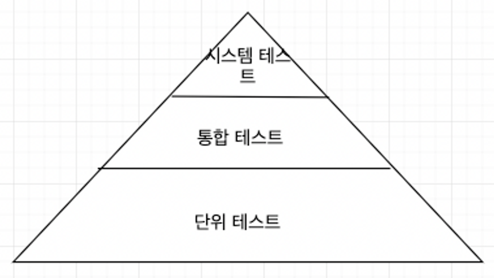
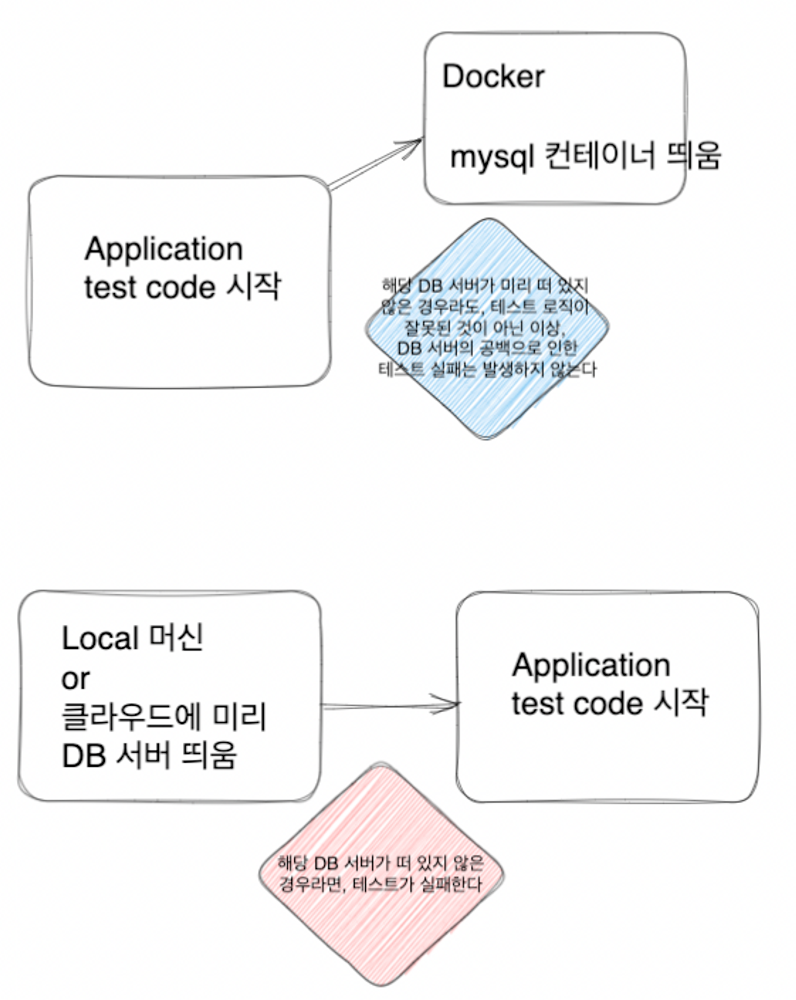

헥사고날 아키텍쳐에서의 테스트 전략은 어떤 것이 좋을까?

테스트에는  “단위테스트” , “통합테스트”, “시스템 테스트”, “엔드 투 엔드 테스트” 가 있다.

테스트 피라미드 라는 것이 있는데 ***테스트 종류별로 얼마나 많은 테스트를 만들어야 하는 가***를 보여 준다.

- 결론적으로 “ **만드는 비용 “ 이 적고, “유지 보수하기 쉽고” , “빨리 실행” 되고 “ 안정적인 작은 크기”** 의 테스트***일 수록 높은 커버리지 를 유지***해야 한다는 것이다.
    - 테스트가 비쌀수록 낮은 목표를 잡아야 한다.

책에서는 아래와 같은 순서로 아키텍쳐 요소별 테스트를 소개 한다.

테스트는 단위테스트 → 통합 테스트 → 시스템 테스트 순으로

아키텍쳐 요소 별 로는 도메인 엔티티 → 유스케이스 → 어댑터 순

즉 **아래와 같은 테스트를 정의하는 전략**을 권장하고 있다.

1. 도메인 엔티티 에 대해서는  단위테스트
2. 유스케이스 에 대해서는 단위 테스트
3. 어댑터 에 대해서는 통합 테스트
4. 사용자 시나리오에 대해서는  시스템 테스트

## 도메인 엔티티 단위 테스트

도메인 엔티티 의 경우, 행동이 ***다른 클래스에 거의 의존하지 않기에*** 다른 종류의 테스트는 필요하지 않다.

( 생각해보면, 헥사고날 아키텍쳐는 도메인 중심의 아키텍쳐이기에, 다른 클래스에 거의 의존하지 않을 것이다.)

## 유스케이스 단위 테스트

- 테스트 서비스가 **“의존 대상(모킹)” 의 특정 메소드와 상호작용 여부를 검증**한다 ( 행위 검증 )
    - 하지만 **이를 과도하게 검증할 경우, 코드 변경(리팩토링) 에 따라 테스트 역시 변경될 확률이 높아** 진다.

( 🤔❓ 책 86p 에서는 테스트 중인 유즈케이스는 서비스 상태가 없어, 상태를 검증할 수 없다고 한다. 유스 케이스에 대한 단위테스트에서는 상태 검증의 가치가 없다는 말인가? )

## 웹 어댑터 통합 테스트

**웹 어댑터에서 일어나는 일들이 기대한 대로 동작 하는지 검증**해야 한다.

1. 통신(웹이니 HTTP )을 통해 입력을 받고
2. 입력 유효성을 검증
3. 유스케이스 포맷으로 변환하고
4. 유스케이스에 변환된 입력을 전달
5. 유스케이스로부터 반환된 결과를 변환하고
6. 통신을 통해 반환

특히 Spring 을 예로 들면, Web controller 는 Spring 이라는 “프레임워크 에 강하게 묶여” 있다.  **웹 계층에서 일어나는 동작들을 지원하는 것들이 프레임워크와 강하게 묶여 있다.  mock HTTP 요청을 생성해준다거나, 이를 테스트 대상 컨트롤러에게 보내준다거나, 객체-JSON 변환을 해주는 등 프레임워크 내부적으로 이들을 지원하고 있다.**

MockMvc 라는 것을 사용하며, ***웹과 관련된 동작들을 모킹하여 테스트를 진행***한다.

따라서 **컨트롤러만을 테스트하기 보다는 “프레임워크와 통합된 상태로 테스트” 하는 것이 필요**한 것이다.

**“프레임워크를 구성하는 웹 계층과 관련된 요소들” 이 프로덕션 환경에서 정상적으로 작동하는 것을 테스트 해야하기 때문**이다.

## 영속성 어댑터 통합 테스트

“데이터 베이스 매핑” 을 검증하고 싶은 것이다.

따라서 실제로 디비 접근이 필요하다.

- DB 를 모킹 하는 것이 아닌, 실제 디비 접근에 필요한 객체 네트워크를 인스턴스화 해야 한다.
    - 실제 DB 연동 시, SQL 구문 오류 or DB 테이블과 자바 객체간의 매핑 에러 등이 존재할 수 있기 때문이다. 따라서 실제 디비와의 매핑을 검증하는 것이 필요하다.
    - DB 라는 외부 자원에 걸친 테스트를 진행하기에 통합테스트다.

그렇다면 이 때 DB 는 “프로덕션 환경의 DB 와 동일한 DB” 여야 할까?

- 프로덕션 환경과 다른 디비를 사용할 경우, 실제 프로덕션환경에선 문제가 생길 수 있다. ( 디비마다 지원하는 고유한 SQL 문법이 다른 등등의 이유로 인해 )
    - Spring 에서 테스트 관련 어노테이션(@DataJpaTest) 을 사용하면 기본으로 인메모리 디비인 H2 를 사용하게 된다.
- 또한 테스트 데이터를 위한 SQL 스크립트를 따로 두고 있는 경우라면, 디비마다의 서로 다른 문법으로 인해, 디비 별로 스크립트를 만들어 둬야 하게 된다.

테스트 에서도 프로덕션환경과 같은 DB 를 사용하는 것이 좋아보인다.

하지만  테스트 실행시 함께 자동으로 실행되는 인메모리 디비와 달리, 테스트가 실행될 때 실제 디비 서버 역시 실행되고 있어야 한다. 만약 디비 서버가 실행되고 있지 않다면 테스트는 실패하게 된다.

따라서 이를 위해서는 “테스트 컨테이너” 를 사용하는 것이 좋을 것이다.

## 시스템 테스트

전체 어플리케이션을 띄워, 모든 계층이 조화롭게 잘 동작하는지 검증한다.

Spring 어플리케이션이라면, 이전의 테스트들과 같이 필요한 bean 들만을 띄우는 것이 아닌, 해당 어플리케이션에 필요한 모든 bean 을 띄우게 되는 것이다. ( 생각만 해도 무겁다 )

앞선 MockMvc 와 달리, “실제 HTTP 통신” 을 한다. 따라서 MockMvc 를 사용하지 않고 TestRestTemplate 을 이용해 요청을 보낸다.

앞서 단위 테스트, 통합 테스트를 만들었다면 시스템 테스트는 앞서 커버한 코드들과 겹치는 부분들이 존재할 것이다. 그럼에도 필요한 이유가 뭘까?

앞선 테스트 는 하나의 시나리오에 대한 “실제의 전체 계층” 에 대한 테스트가 아니었다. 따라서 계층간 매핑 버그와 같은 것을 커버하지는 못한다. 이처럼 또 다른 종류의 버그를 발견하고 수정할 수 있게 하기 때문이다.

## 유지보수에 어떤 도움을 줄까?

헥사고날 아키텍쳐는 “도메인 로직”과 “어댑터” 를 깔끔하게 분리 할 수 있었다.

- 덕분에 도메인 엔티티에 대해서는 단위 테스트로 커버가 가능해졌다.

입출력 포트는 뚜렷한 모킹 지점이 된다. 어떤 포트 인터페이스를 사용할지 명확하게 하기 위해서는, 각 포트가 “적은 메소드” 를 제공하는 것이 좋다.

- 코드의 특정 부분을 커버하기 위해 “어떤 종류의 테스트” 를 해야할지 모르겠다면 이는 무언가 분리가 제대로 되지 않았음을 의심해 볼 수 있을 것이다.
    - 이 처럼 테스트 를 통해, 아키텍쳐의 문제에 대해 파악할 수도 있게 된다.