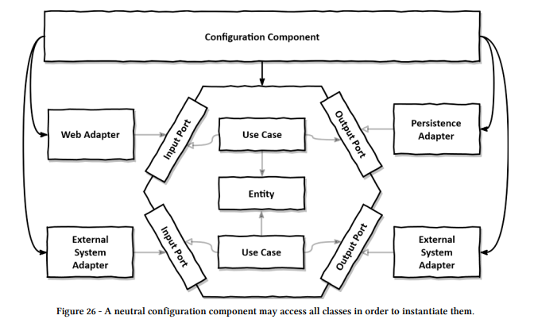

# 9. 애플리케이션 조립하기

## 왜 조립까지 신경 써야 할까?
- 왜 유스케이스와 어탭터를 그냥 필요할 때 인스텅스화하면 안 되는 걸까?
    - 코드 의존성이 올바른 방향을 가리키게 하기 위해서이다(안쪽으로, -> 도메인 방향)
- 만약 유스케이스가 영속성 어탭터를 호출해야 하고, 스스로 인스턴스화한다면 의존성의 방향이 잘못된것이다.
    - 이것이 바로 아웃고잉 포트 인터페이스를 구현한 이유이다.
- **유스케이스는 인터페이스만 알아야 하고, 런타임에 이 인터페이스의 구현을 제공받아야 한다**.
    - 이러한 스타일의 부수효과로는 한 클래스가 필요로 하는 모든 객체를 생성자로 전달할 수 있다면 실제 객체 대신 목으로 전달가능 하며 격리된 단위 테스트를 생성하여 코드 테스트가 쉬워진다.

> 즉 의존성의 방향을 안쪽으로 유지하는 스타일을 고수 + 클래스의 의존성 객체를 생성자로 전달 가능 -> 해당 configuration 클래스를 만들어 제어함으로써 mock 테스트를 통한 격리된 단위 테스트가 쉬워진다.

- 모든 클래스에 대한 의존성을 가지는 설정 컴퍼넌트(configuration component) 가 있어야 한다. 애플리케이션의 나머지 부분을 깔끔하게 유지하기 위해서라면 단일 책임 원칙(변경할 이유)를 위반한 설정 컴포넌트가 필요하다.


### 설정 컴포넌트의 역할
- 웹 어댑터 인스턴스 생성
- HTTP 요청이 실제로 웹 어댑터로 전달되도록 보장
- 유스케이스 인스턴스 생성
- 웹 어댑터에 유스케이스 인스턴스 제공
- 영속성 어댑터 인스턴스 생성
- 유스케이스에 영속성 어댑터 인스턴스 제공
- 영속성 어댑터가 실제로 데이터베이스에 접근할 수 있도록 보장

## 평범한 코드로 조립하기
```java
package com.book.cleanarchitecture.buckpal;

import com.book.cleanarchitecture.buckpal.account.adapter.in.web.SendMoneyController;
import com.book.cleanarchitecture.buckpal.account.adapter.out.persistence.AccountPersistenceAdapter;
import com.book.cleanarchitecture.buckpal.account.application.port.in.SendMoneyUseCase;
import com.book.cleanarchitecture.buckpal.account.application.service.SendMoneyService;

public class Application {
    public static void main(String[] args) {
        AccountRepository accountRepository = new AccountRepository();
        ActivityRepository activityRepository = new ActivityRepository();

        AccountPersistenceAdapter accountPersistenceAdapter = new AccountPersistenceAdapter(accountRepository, activityRepository);

        SendMoneyUseCase sendMoneyUseCase = new SendMoneyService(
                accountPersistenceAdapter,
                accountPersistenceAdapter
        );

        SendMoneyController sendMoneyController = new SendMoneyController(sendMoneyUseCase);
        
        startProcessingWebRequests(sendMoneyController);
    }
}
```
- 웹 컨트롤러, 유스케이스, 영속성 어댑터가 단 하나씩만 있는 애플리케이션 -> 애플리케이션이 복잡해지면 코드량도 증가한다.
- 각 클래스가 속한 패키지 외부에서 인스턴스를 생성하기 때문에 이 클래스들은 전부 public이여야 한다.(유스케이스가 영속성 어탭터에 직접 접근하는 것을 막지 못한다)
- 다행히도 package-private 의존성을 유지하면서 이처럼 지저분한 작업을 대신해줄 수 있는 주입 프레임워크가 있는데 그게 바로 spring이다.

## 스프링의 클래스패스 스캐닝으로 조립하기
- 스프링 프레임워크를 이용해서 애플리케이션을 조립한 결과물을 애플리케이션 컨텍스트라고 한다. 애플리케이션 컨텍스트는 애플리케이션을 구성하는 모든 객체(자바 용어로는 빈(bean))을 포함한다.
- 스프링은 클래스패스 스캐닝으로 클래스패스에서 접근 가능한 모든 클래스를 확인해서 `@Component` 애너테이션이 붙은 클래스를 찾는다.
- 스프링이 인식할 수 있는 커스텀 애노테이션도 생성 가능하다.

```java
package com.book.cleanarchitecture.buckpal.shared;

import org.springframework.core.annotation.AliasFor;
import org.springframework.stereotype.Component;

import java.lang.annotation.*;

@Target({ElementType.TYPE})
@Retention(RetentionPolicy.RUNTIME)
@Documented
@Component
public @interface UseCase {

    @AliasFor(annotation = Component.class)
    String value() default "";
}
```
### 단점
- 클래스에 프레임워크에 특화된 애너테이션을 붙어야 한다는 점에서 침투적이다. 특정 프레임워크와 결합도니다.
- 마법 같은 일이 일어날 수 있다. - 스프링 전문가 아니라면 원인을 찾기 어려울 수 있다.

## 스프링의 자바 컨피그로 조립하기
> 클래스패스 스캐닝이 곤봉이라면 스프링의 자바 컨피그는 수술용 메스이다.

```java
@Configuration
@EnableJpaRepositories
class PersistenceAdapterConfiguration {

	@Bean
	AccountPersistenceAdapter accountPersistenceAdapter(
		AccountRepository accountRepository,
		ActivityRepository activityRepository,
		AccountMapper accountMapper){
	return new AccountPersistenceAdapter(
		accountRepository,
		activityRepository,
		accountMapper);
}

@Bean
AccountMapper accountMapper(){
	return new AccountMapper();
}

```
- `@Configuration` 을 통해 스캐닝을 가지고 찾아야 하는 설정 클래스임을 표시한다.
- 이건 모든 빈을 가져오는 대신 설정 클래스만 선택하기 때문에 , 마법이 일어날 일은 적다.
- 특정 모듈만 포함하고, 그 외의 다른 모듈의 빈은 모킹해서 애플리케이션 컨텍스트를 만들 수 있다.(테스트에 큰 유연성)
- `@Component` 애너테이션을 붙이는 것을 강제하지 않아 애플리케이션 계층을 스프링 프레임워크에 대한 의존성 없이 유지 가능
### 단점
- 설정 클래스와 같은 패키지에 넣어놓지 않는 경우에 `public` 으로 해야 한다.
- 패키지를 모듈 경계로 사용하고 각 패키지 안에 전용 클래스를 만들 수 있지만, 하위 패키지를 사용할 순 없다.(10장)

## 유지모수 가능한 소프트웨어를 만드는 데 어떻게 도움이 될까?
- 클래스패스 스캐닝은 매우 유용하다.
    - 하지만 코드의 규모가 커지면 투명성이 낮아져 전체적인 파악이 어렵고, 테스트에서 애플리케이션 컨텍스트의 일부만 독립적으로 띄우기가 어렵다.
- 전용 설정 컴포넌트를 띄우면 서로 다른 모듈로부터 독립되어 코드상의 쉽게 옮겨 다닐 수 있는 응집도가 매우 높은 모듈을 만들 수 있다.
    - 하지만 설정 컴포넌트를 유지보수하는데 시간이 추가된다.

> **클래스패스 vs 전용 설정 컴포넌트**
상황마다 다르지만 상황에 맞는 선택을 하는 이유의 근거를 배울 수 있었다.