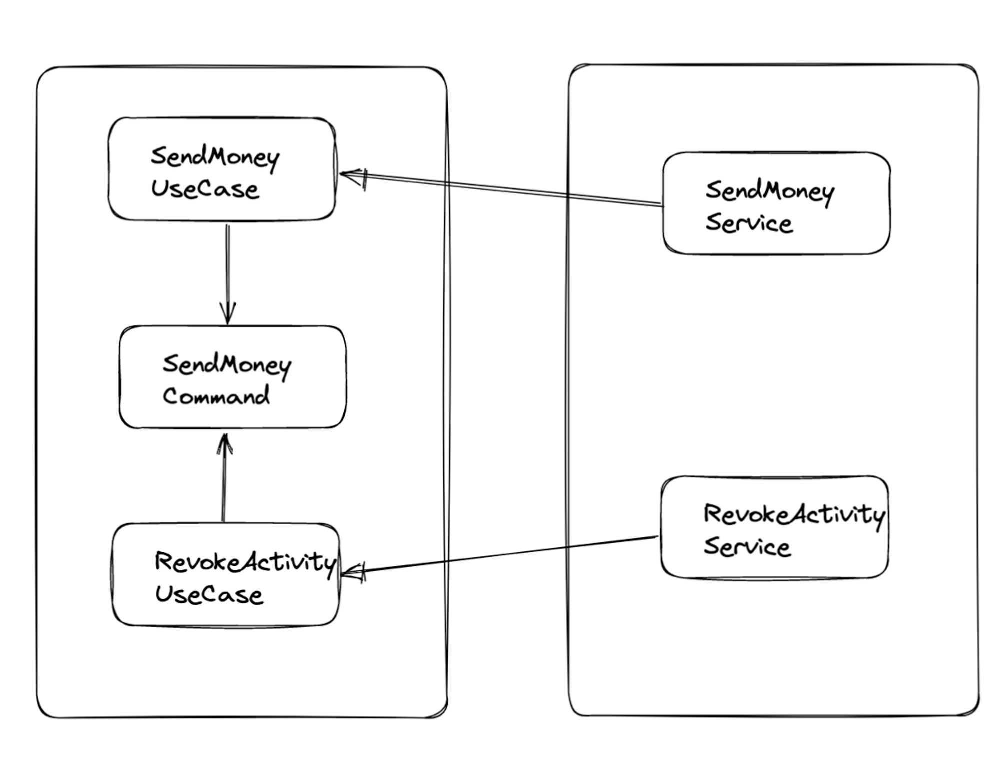
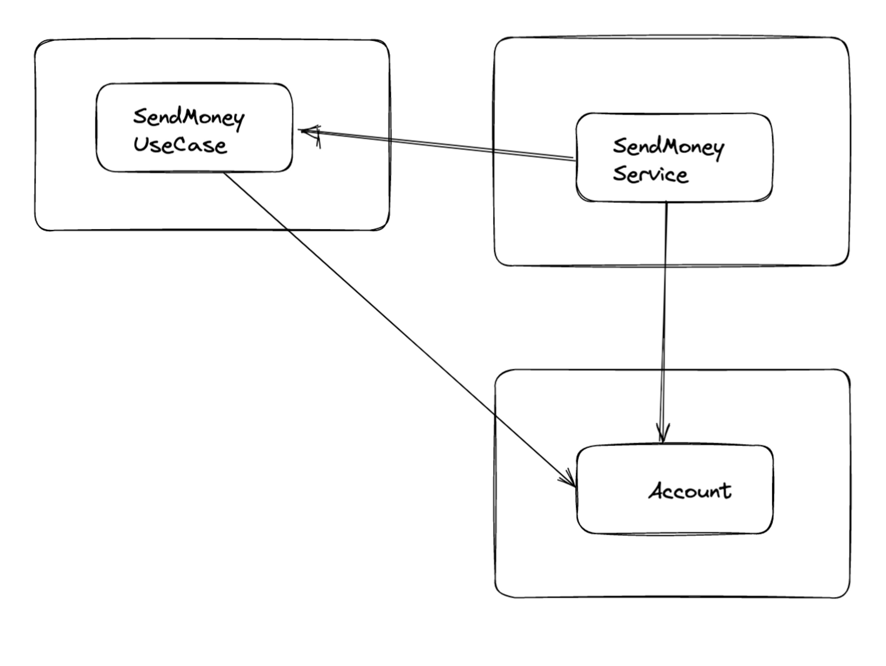
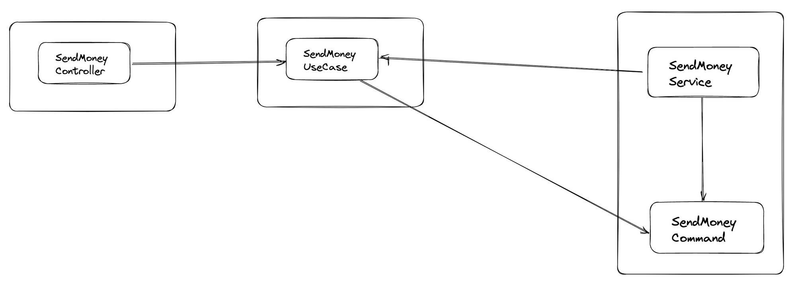
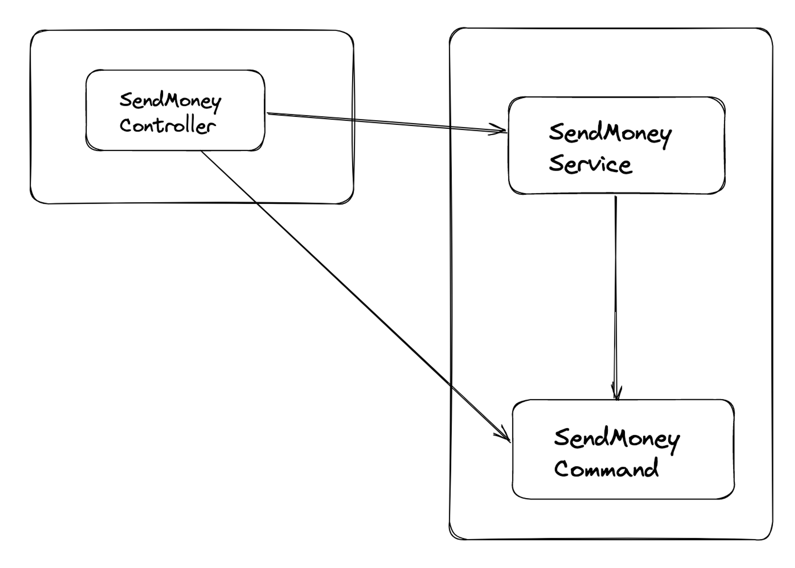

코드를 작성하다보면 지름길로 가고 싶은 유혹을 느끼곤 한다.

깨진 창문 이론에 의하면, 사람들은 한 번 망가진 차를 계속해서 더욱 망가뜨리는 경향이 있다.

코드 역시 한 번 레거시 였다면 이를 망가뜨리는 것에 망설임이 덜 해진다는 것 ㅎㅎ

책에서 나온 육각 아키텍쳐는 도메인으로 의존성을 향하도록 하기 위해서**, port 를 나누고 , 유즈 케이스를 나누고, 모델들을 나눈**다.

다들 이런 기분을 겪어봤겠지만.. 단순한 CRUD 유즈케이스를 위해 위의 아키텍쳐를 구현하는 것은 지나치게 느껴진다. 중간 추상화 계층을 두는 것 자체가 번거롭게 느껴지기도 한다. “이게 지금 필요한가?” 이런 생각이 든다.

지나치다고 느껴진다면, **우리는 이 중 하나라도 생략하게 될 것**이다. 중간의 추상화를 생략하거나, 모델을 공유하게 되는 것이다.

책에서는 **이런 상황을 지름길**로 표현하고 있다.

- 유즈케이스 간에 모델을 공유

  

    - 결과 : “변경할 이유” 를 “공유” 하게 된다. A 유즈케이스를 위해 모델을 변경해야 하는 경우, B 유즈케이스에까지도 영향을 미치게 된다.
    - 공유해도 괜찮은 경우도 있나?
        - 두 유즈케이스가 기능적으로 유사할때 == 특정 요구사항을 공유 할 때 ( 애초에 하나의 모델을 공유하며, 모델 하나만을 변경해도 두 유즈케이스 모두에 영향을 주고 싶은 경우 )
    - 공유하던 모델을 분리할 시점?
        - 비슷한 개념을 다루는 두 유즈케이스 임에도, 독립적으로 발전 시킬 필요성이 느껴질 때.
- 도메인 엔티티를 입출력 모델로 사용

  

    - 결과 : 엔티티를 변경할 이유가 생기게 되는 것.
        - 엔드포인트에서 필요로 하는 스펙을 위해 “도메인 엔티티” 를 변경하고 싶어 짐
        - 즉, 유즈케이스 변경이 도메인 엔티티까지 전파된다.
    - 유즈케이스 전용 입출력 모델을 만들어야 할 시점
        - 도메인 로직이 풍부해 질 때.
        - 애자일 식으로 개발하는 경우 특히, 간단한(CRUD) 유즈케이스에서 복잡한 도메인 으로 변경되어가기에 이 시점을 잘 파악 해야함.
- 인커밍 포트 건너뛰기 : 즉 인터페이스가 아닌, 직접적인 유즈케이스를 사용하는 것

  

  

    - 결과: 특정 유즈케이스를 위한 서비스 구현체들에 대해 알고 있어야 하게 된다.
    - 인커밍 포트의 장점은 무엇일까?
        - 아키텍쳐 강제화가 가능. → 10장에 서 봤던 것 처럼, 특정 유즈케이스에 대한 포트만을 외부로 노출시킨다면, 외부에서 서비스 구현체에 직접 접근할 수 없다. 위와 같은 지름길을 사용한다는 것은 서비스 구현체들이 외부에서 접근이 가능하다는 것인데, 이로 인해 실수로 인커밍 어댑터에서 다른 서비스 구현체까지 호출할 가능성도 존재하지 않을까?

하지만 유즈케이스가 단순한 CRUD 를 벗어나, 복잡해지는 순간, 외부의 요인들에 의해 도메인 코드가 영향을 받을 확률도 높아진다. 만약 “도메인 코드” 가 중요한 상황이라면, 외부 요인(사용하는 기술 등) 에 의해 도메인 코드가 변경되는 것은 바람직하지 못하다. 특히 DDD 에서는 도메인이 개발을 주도하기 때문에, 육각형 스타일은 DDD 의 조력자 라고 할 수도 있다.

그렇다면 이 때 중요한 것은, 책에서 말하는 지름길을 사용했다면 유즈케이스가 단순한 CRUD 상태에서, 복잡한 유즈케이스로 가는 시점에 대해 팀 내의 합의를 하는 것이라고 생각한다..

도메인이 중요한 어플리케이션이라면, 육각 아키텍쳐와 같이 도메인 코드에 집중할 수 있도록 하는 아키텍쳐를 구축하는 것에 대한 논의가 필요할 듯 하다.

여전히 어떤 아키텍쳐 스타일을 골라야할지에 대해서는 결정을 내리기가 어렵다고 느껴진다. 책에서 말하는 것과 같이, 직접 다양한 아키텍쳐를 경험해보는것, 작은 모듈이라도 새로운 아키텍쳐를 적용해보는 것 이 중요한 것 같다. 아키텍쳐에 자신의 생각을 추가해 스타일을 개발하는 것도 좋을 것 같다.